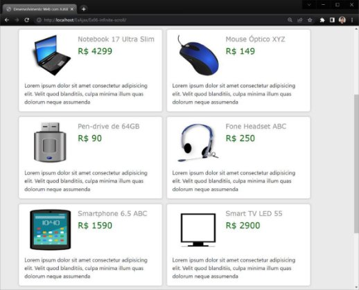

# ProjetoWebPPI

**Universidade Federal de Uberlândia               Faculdade de Computação – Prof. Daniel A Furtado Projeto Final de Programação para Internet**

**INTRUÇÕES GERAIS**

- Esta atividade deve ser realizada em equipes de no máximo 3 alunos;
- Antes de iniciar a implementação, recomenda-se a leitura completa deste documento;
- **Não é permitido o uso** de tecnologias ou recursos não apresentados em aula como flexbox, jQuery, React, Node.js, Angular, etc. Projetos utilizando tais tecnologias serão anulados;
- Os  alunos  envolvidos  em  qualquer  tipo  de  plágio,  total  ou  parcial,  seja  entre  equipes*  ou  de trabalhos de semestres anteriores ou de materiais disponíveis na Internet (exceto os materiais de aula disponibilizados pelo professor), serão duramente penalizados (art. 196 do Regimento Geral da UFU). Todos os alunos envolvidos terão seus **trabalhos anulados** e receberão **nota zero**.
- O  website  não  deve  conter  nenhum  conteúdo  de  caráter  imoral,  desrespeitoso,  pornográfico, discurso de ódio, desacato, etc.;
- O website deve ser estruturado em pastas e subpastas conforme instruções do material de HTML;
- Além da entrega pelo sistema SAAT, o projeto deve ser apresentado ao professor, por toda a equipe, em data a ser agendada. A avaliação é individual. TODOS os membros da equipe precisam conhecer em detalhes TODOS os recursos implementados, seja de *front-end* ou *back-end*. Durante a apresentação, perguntas específicas poderão ser feitas de qualquer parte do projeto a qualquer membro  da  equipe  e  as  respostas  serão  utilizadas  como  parte  da  avaliação  individual  dos membros;
- Projetos entregues, mas não apresentados oralmente ao professor, não serão considerados;
- O website implementado deve ser responsivo (especialmente os formulários);
- O website implementado deve prevenir ataques do tipo *cross-site scripting* (XSS) e *SQL Injection;*
- A comunicação com o MySQL deve ser feita utilizando o **PHP Data Objects** (PDO) do PHP;
- Não adicione campos extras nos formulários além daqueles solicitados;
- Todas as requisições Ajax devem retornar os dados no formato JSON;
- As requisições Ajax devem utilizar o XMLHttpRequest ou a API Fetch (com ou sem async/await);
- O  website  deve  ser  implementado  utilizando  os  recursos  gratuitos  (PHP,  MySQL,  etc.)  do awardspace.com/infinityfree.net (ou similares, desde que disponibilizem os recursos exigidos);
- O website deve ser validado utilizando as ferramentas disponíveis nos endereços **validator.w3.org** e **jigsaw.w3.org/css-validator** (não deve conter nenhum erro ou *warning*);

**1ª Entrega pelo SAAT: 20/04/2023 2ª Entrega pelo SAAT: 12/06/2023**

**Descrição Geral **

Este trabalho tem como objetivo desenvolver um portal de anúncios para a web. O portal deve oferecer funcionalidades  básicas  para  permitir  que  qualquer  internauta  possa  se  cadastrar,  efetuar  login  e anunciar  um  produto  qualquer  (como  carro,  celular,  eletrodoméstico,  imóvel,  etc.).  Os  produtos anunciados pelos usuários devem ser disponibilizados na página principal do portal mediante pesquisa por palavras-chave. O portal também deve permitir que um usuário interessado em algum produto possa  deixar  sua  mensagem  de  interesse,  a  qual  deve  ser  posteriormente  apresentada  ao  dono  do anúncio quando este fizer login no portal.

A parte do portal voltada para o público em geral deve conter:

1. Uma página principal para busca e exibição dos resultados;
1. Uma página para visualização detalhada do anúncio e registro de interesse;
1. Uma página de login para que um usuário já cadastrado possa entrar e anunciar seu produto;
1. Uma página de cadastro para que um novo usuário (anunciante) possa se cadastrar no portal.

A parte do portal de acesso restrito deve conter telas/páginas para:

1. Criação de novo anúncio;
1. Listagem dos anúncios do usuário;
1. Exclusão de anúncio (com respectiva exclusão das fotos);
1. Visualização das mensagens de interesse deixadas para os anúncios;
1. Exclusão das mensagens de interesse;
1. Alteração dos dados de cadastro (exceto e-mail);

Todas  as  páginas  do  website  devem  possuir  um  layout  contendo quatro  partes  bem  definidas:  um cabeçalho, uma barra de navegação, um rodapé e uma parte principal para exibição de conteúdo.  

**Parte de Acesso Público **

A parte de acesso público do portal deve ser implementada **sem utilizar** o framework Bootstrap. Todos os estilos e layouts devem ser desenvolvidos utilizando apenas CSS.  

**Busca por Anúncios / Página Principal**

Cada grupo deverá criar um nome fictício para o portal de anúncios, assim como um logotipo. O nome do portal e o logotipo devem ser exibidos na página principal utilizando um layout moderno e bem estruturado.  

A página principal deverá oferecer um campo textual para que o usuário possa informar livremente as palavras-chave de busca (por ex. “notebook 15 full hd”). Deve haver também um botão para efetivar a busca.

O portal deve oferecer, também na página principal, uma opção de **busca avançada**, inicialmente oculta. A  busca  avançada  deve  possibilitar  que  o  usuário  escolha  se  deseja  fazer  a  busca  no  **título**  ou  na **descrição** dos anúncios. Deve apresentar também dois campos para que o usuário informe a faixa de preços de interesse (o usuário deve poder **digitar** o preço mínimo e o preço máximo). Por fim, a busca avançada deve apresentar uma caixa de seleção para que o usuário informe a categoria dos anúncios em que a busca deve ser feita (devem ser apresentadas na caixa de seleção todas as categorias correntemente cadastradas no banco de dados). Este campo deve possuir um valor padrão que habilite a busca em todas as categorias de anúncios.

Os  parâmetros  da  busca  devem  ser  enviados  ao  servidor  por  meio  de  uma  requisição  Ajax  e  os resultados devem ser exibidos por meio de atualização dinâmica da página com JavaScript, **sem efetuar um recarregamento completo ou redirecionamento** (veja detalhes nas seções a seguir).

**Exibição dos Resultados da Busca**

Os  resultados  da  busca,  retornados  pela  requisição  Ajax  no  formato  JSON,  devem  ser  inseridos dinamicamente na página HTML utilizando JavaScript para manipular a estrutura DOM. Inicialmente a busca no servidor deve retornar os 6 primeiros resultados, que devem ser inseridos adequadamente no final da página de busca.  

Quando o usuário rolar a página até o final dos resultados, uma requisição Ajax deve buscar no servidor os próximos 6 resultados, os quais devem ser adicionados dinamicamente no final da lista de resultados. Esse processo deve se repetir, em um mecanismo de “rolagem infinita”, enquanto haver resultados a serem exibidos para a busca (não deve ser requisitado ao usuário nenhum tipo de clique em botão ou link para exibição de mais resultados).

Os resultados devem ser exibidos em *cards*, de maneira moderna, responsiva e organizada. Apenas uma parte inicial do texto da descrição do anúncio deve ser apresentada nos *cards*. A descrição completa, assim como informações adicionais como a localização (estado, cidade e bairro) e eventuais fotos extras, devem ser apresentados em página específica, na **página de exibição detalhada do anúncio**.

Uma ideia para a apresentação dos *cards* é dada a seguir:

**Implementação da Busca no Servidor**

A busca por anúncios deve ser implementada no servidor utilizando apenas as cinco primeiras palavras- chave  informadas  pelo  usuário  (as  demais  devem  ser  descartadas).  A  busca  deve  utilizar  uma concatenação dinâmica de condições na cláusula **where** da consulta SQL, de acordo com a quantidade de palavras-chave. A consulta SQL deve ter um formato similar ao exemplo a seguir (porém com as devidas adaptações para evitar ataques de injeção de SQL):

SELECT ...

FROM ...

WHERE ... AND

``descricao like ‘%palavraChave1%’ AND       descricao like ‘%palavraChave2%’ AND       descricao like ‘%palavraChave3%’ ...

**Dica**: ao utilizar *prepared statements*, utilize o caracter **?** sem aspas e adicione o caracter **%** no início e no final da *string* de cada palavra previamente.  

A consulta SQL deve ordenar os resultados em ordem decrescente da data do anúncio, para que os últimos anúncios publicados sejam exibidos prioritariamente nos resultados.

O  script  de  busca  deve  obrigatoriamente  retornar  os  resultados  no  formato  JSON.  A  *string*  JSON resultante deve corresponder a um *array* de objetos, onde cada objeto contém as informações de um dos anúncios do resultado.

Para implementar o processo de paginação dos resultados no servidor utilize as opções LIMIT e OFFSET na consulta SQL. A opção LIMIT pode ser utilizada para indicar o número máximo de linhas a ser retornado e a opção OFFSET indica o número de linhas iniciais do resultado que devem ser descartadas. Por exemplo, o código a seguir retornaria a 3ª página dos resultados (observe que, com 6 itens por página, a 3ª página começaria na posição 12 dos resultados):

SELECT ...

FROM ...

WHERE ...  

LIMIT 6 OFFSET 12

**Página de Login**

A página de *login* deverá exibir um pequeno formulário com os campos **e-mail** e **senha** para que os **anunciantes**  do  portal  possam  *logar*  e  ter  acesso  à  parte  restrita.  O  formulário  de  *login*  deve  ser apresentado de maneira bem estruturada e moderna. **A validação dos dados de login deve ser feita em segundo  plano,  com  Ajax**.  Mensagens  adequadas  devem  ser  apresentadas  caso  os  dados  estejam incorretos (por meio da manipulação da estrutura DOM, sem que a página seja recarregada).

Para validar os dados de login utilize o campo **E-mail** da tabela **Anunciante** juntamente com o campo **SenhaHash** (veja o esquema de dados no final deste documento).

**Cadastro de Novo Usuário / Anunciante**

Deverá  haver uma  página  para  que  novos usuários  do  portal  possam  se  cadastrar. As informações apresentadas na tabela **Anunciante** (veja esquema no final deste documento) devem ser requisitadas por meio de formulário apropriado. Os dados devem ser validados com JavaScript (e/ou CSS), conforme apresentado nos materiais de aula. Uma posterior validação no servidor também deve ser feita.

**Parte de Acesso Restrito **

A parte de acesso restrito deve ser apresentada apenas depois que o usuário fizer *login*. O controle da sessão  deve  ser  feito  de  maneira  adequada,  utilizando  o  conceito  de  sessões  do  PHP,  de  forma  a impossibilitar o acesso às páginas restritas sem que o *login* tenha sido feito. A parte de acesso restrito deve ter um botão do tipo *logoff*/*sair* para que a sessão seja encerrada.

O framework Bootstrap pode ser utilizado na confecção das páginas desta parte do portal (de acesso restrito). Entretanto, seu uso **não** é permitido nas páginas de acesso público (busca, resultados, criação de conta, login, etc.).  

**Criação de Novo Anúncio**

A  parte  restrita  do  sistema  deve  disponibilizar  uma  página  para  que  o  usuário  possa  cadastrar  as informações de um novo anúncio, conforme esquema de dados apresentado no final deste documento. O  formulário  deve  ser  claro,  bem  estruturado  e  de  fácil  preenchimento  (sempre  com  campos adequados). Outros requisitos são:

- Deve possibilitar ao usuário selecionar pelo menos uma foto para o produto anunciado;
- A foto do produto deve ser devidamente **renomeada** e **armazenada** no servidor, mas **não em tabelas** do banco de dados.  **Apenas o nome gerado para o arquivo da foto** deve ser armazenado de forma apropriada na tabela **Foto** do banco de dados (conforme esquema de dados);
- Deve haver um campo de seleção para que o usuário informe a **categoria** do produto sendo anunciado. O campo de seleção deverá exibir as categorias que estiverem cadastradas na tabela **Categoria**  do  banco  de  dados  (cadastrar  manualmente  na  tabela  as  categorias  Veículo, Eletroeletrônico, Imóvel, Móvel, Vestuário e Outro);
- O  preenchimento  dos  campos  de  endereço  deve  ser  facilitado  utilizando  Ajax.  Assim  que  o usuário preencher o CEP, uma requisição Ajax deve buscar no **próprio** servidor, na tabela “Base de Endereços Ajax”, os demais dados do endereço relativo ao CEP indicado (bairro, cidade e estado).  Um  código  JavaScript  deverá  completar  os  campos  do  formulário  automaticamente conforme dados retornados pela requisição. Se o CEP não estiver cadastrado no servidor, os campos não precisam ser preenchidos automaticamente.

**OBS 1**: esta funcionalidade deve ser implementada. Serviços/APIs de busca de endereço de terceiros não devem ser utilizadas. Caso seja, o recurso será desconsiderado na avaliação do trabalho.

**OBS  2:**  os  dados  do  endereço  do  anunciante  precisam  ser  inseridos  normalmente  na  tabela **Anunciante**. Não faça qualquer ligação com os dados de endereço cadastrados na tabela “Base de Endereços Ajax”. Esta tabela é auxiliar e seu único objetivo é prover dados para o serviço de auxílio no preenchimento do formulário.

- Os dados do novo anúncio devem ser inseridos adequadamente nas tabelas **Anúncio** e **Foto** do banco de dados por um script PHP. O conceito de **transações** **deve ser utilizado**.

**Demais Páginas da Parte Restrita**

As demais páginas da parte restrita devem ser construídas de tal forma que as funcionalidades listadas na seção **Descrição Geral** deste documento sejam atendidas. Recomenda-se a utilização do framework Bootstrap para auxiliar na confecção de páginas e formulários responsivos.  

**Banco de Dados - Esquema das Tabelas **

O banco de dados do sistema deve ser criado conforme o esquema de dados apresentado a seguir, incluindo todos os elementos de dados, chaves e relacionamentos.

**Observações:**

- O campo **Codigo** nas tabelas **Anunciante**, **Anuncio**, **Categoria** e **Interesse** deve ser chave primária;
- O campo **CodCategoria** em **Anuncio** deve ser chave estrangeira conectando com **Categoria**;
- O campo **CodAnunciante** em **Anuncio** deve ser chave estrangeira conectando com **Anunciante**;
- O campo **CodAnuncio** em **Interesse** deve ser chave estrangeira conectando com **Anuncio**;

**Anunciante  Base de **

**Endereços Ajax** *Codigo*

Nome  CEP

CPF  Bairro

Email  Cidade SenhaHash  Estado  1

Telefone

1 N

**Anuncio  Categoria **

``*Codigo*  N  1  *Codigo*

Titulo  Nome Descricao  Descricao

``Preço

DataHora

``CEP  **Interesse**

Bairro  1  N  *Codigo*

Cidade  Mensagem   Estado  DataHora

*CodCategoria*  Contato

*CodAnunciante  CodAnuncio*

1 N

**Foto**

CodAnuncio NomeArqFoto

**Outros critérios de avaliação: **

- Otimização/eficiência das operações implementadas;
- Uso adequado dos recursos conforme solicitado neste documento e apresentado nos materiais de aula;
- Domínio dos conceitos e técnicas durante a apresentação oral do projeto;
- Uso adequado dos elementos semânticos da HTML;
- Atendimento à especificação da HTML5/CSS (páginas validadas);
- Usabilidade, elegância, segurança, responsividade e robustez do website;
- Facilidade de manutenção do website;
- Cumprimento dos requisitos de entrega, incluindo os nomes dos integrantes e URL;
- Cumprimento dos prazos.

**Primeira Entrega **

Todos os integrantes da equipe devem enviar pelo sistema SAAT, até a primeira data de entrega, um arquivo compactado contendo uma versão preliminar do portal, incluindo as seguintes páginas:

- A  página  principal  da parte  pública,  sem  efetivar  buscas  e  sem  listar  qualquer  resultado. A página principal já deve conter o nome definitivo do portal, o logotipo, etc.
- Uma  segunda  versão  da  página  principal  contendo  uma  demonstração  de  listagem  dos resultados (*cards*) com pelo menos 6 resultados;
- Uma página exibindo um anúncio fictício em detalhes, com informações completas e fotos;
- A página de cadastro de novos usuários (anunciante);
- A página de login;

Deverá haver um arquivo de nome **integrantes.txt** contendo os nomes dos alunos e o nome do portal.

**Entrega Final **

O sistema completo deve ser colocado online até a segunda data de entrega indicada no início deste documento. Recomenda-se o registro de um nome de domínio apropriado para o portal de anúncios (há nomes de domínios a partir de R$ 5,00), com respectivo redirecionamento para o subdomínio gratuito onde  o  website  é  efetivamente  hospedado.  Como  alternativa,  pode-se  registrar  apenas  um  **novo subdomínio** no infinityfree.net, com nome apropriado para o portal de anúncios.

Além da disponibilização online, **também é necessário** compactar a pasta raiz do sistema web (contendo todos os arquivos e recursos necessários para o seu funcionamento) e enviar o arquivo compactado, até a data limite de entrega, pelo sistema SAAT [(www.furtado.prof.ufu.br)](http://www.furtado.prof.ufu.br/). **OBS**: caso o arquivo compactado possua mais de 10 MB de tamanho, poderá ser necessário reduzir a resolução das imagens para que esse limite não seja ultrapassado.

Na versão entregue ao professor, a equipe deverá incluir na pasta raiz os seguintes arquivos de texto:

- Arquivo **tabelas.sql** contendo o código SQL necessário para criação das tabelas do BD;
- Arquivo **integrantes.txt** contendo os**nomes dos membros da equipe;**
- Arquivo **endereço.txt** contendo o nome do portal de anúncios e a URL de acesso online.